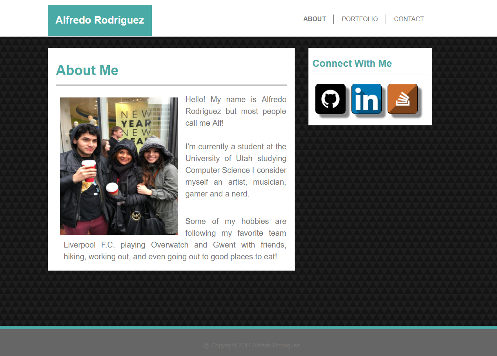

<h1 align="center">Basic-Portfolio</h1>

    

<h3>Technologies used</h3>

<ul>
    <li><strong>HTML</strong></li>
    <li><strong>CSS</strong></li>
</ul>

<h3>Check it out!</h3>

<ul>
    <li><strong>https://alrod909.github.io/Basic-Portfolio/</strong></li>

</ul>

